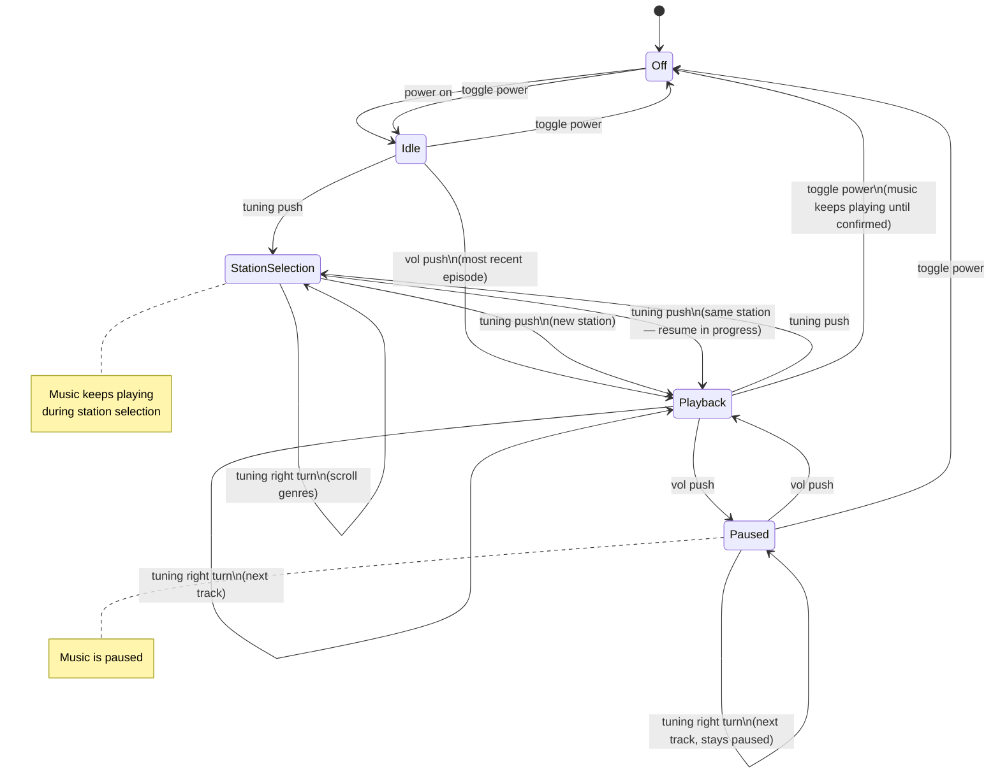

# Bandcamp Radio Radio — Interaction Flow

```mermaid
stateDiagram-v2
    [*] --> Off

    Off --> Idle : power on

    Idle --> StationSelection : tuning push
    Idle --> Playback : vol push\n(most recent episode)
    Idle --> Off : toggle power

    StationSelection --> StationSelection : tuning right turn\n(scroll genres)
    StationSelection --> Playback : tuning push\n(new station)
    StationSelection --> Playback : tuning push\n(same station — resume in progress)

    Playback --> StationSelection : tuning push
    Playback --> Playback : tuning right turn\n(next track)
    Playback --> Paused : vol push
    Playback --> Off : toggle power\n(music keeps playing until confirmed)

    Paused --> Playback : vol push
    Paused --> Paused : tuning right turn\n(next track, stays paused)
    Paused --> Off : toggle power

    Off --> Idle : toggle power

    note right of StationSelection
        Music keeps playing
        during station selection
    end note

    note right of Paused
        Music is paused
    end note
```
